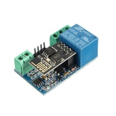
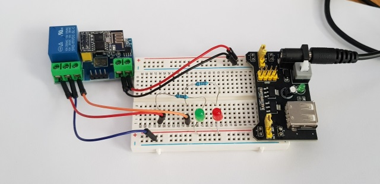
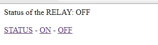

# ESP8266 Relay module

Like many people I purchased this cheap ESP8266 powered module online and assumed it would be easy to use!

It comes with some code burned in that you have to interface with using an AT command set, and to be honest that makes it pretty useless for home automation. However, it is powered by an ESP8266, which means that you must be able to do something with it.

After a lot of Googling I managed to pull enough comments and wiring diagrams together to get this working, so to save anyone else out there having the same problem, I thought I'd make this bare bones sketch available!

## Wiring example

## Compiling

Create a "credentials.h" file in the sketch folder containing the following:

`#define WIFI_SSID "MySSID"`

`#define WIFI_PASSWORD "MyPassword"`

Compile and upload the sketch to your ESP.

## Running

The module will print out the IP address to the serial console at 9600 baud.

This is the baud rate the relay controller reads, so when you toggle the relay it will also print unreadable characters to the serial bus.

Load the IP into your browser and you will see a simple webpage to allow you to control the relay.

